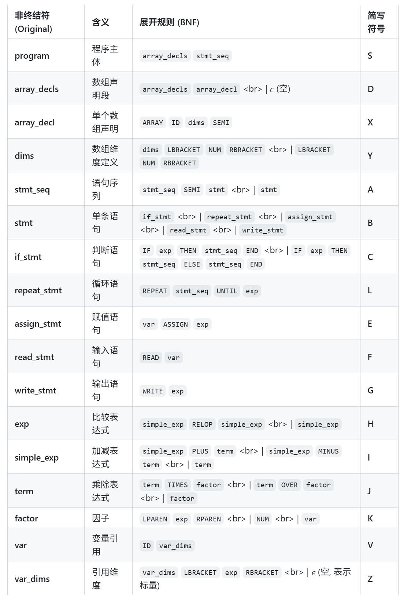
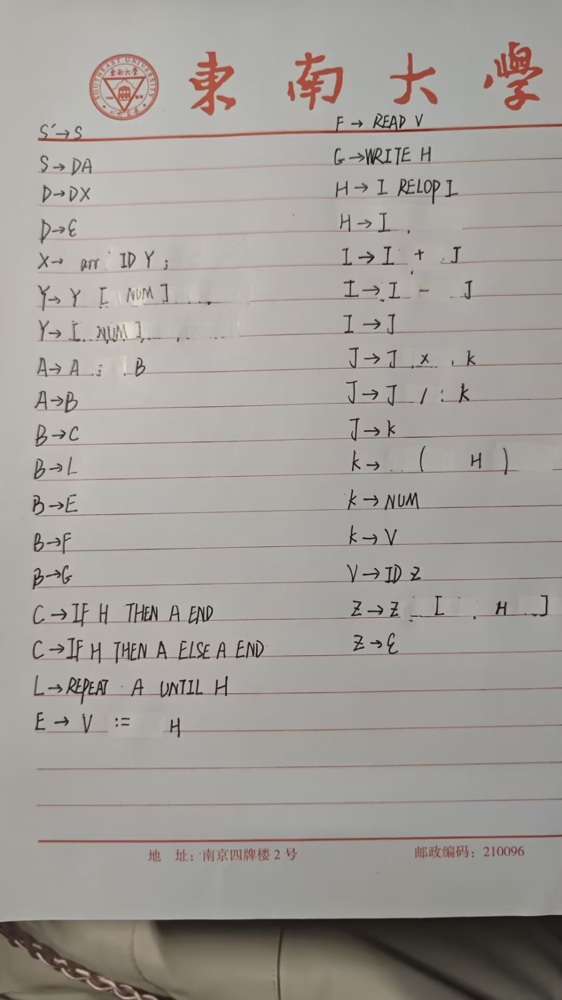

# 东南大学编译原理课程实验二语法分析器

使用方法
1.clone项目

    git clone https://github.com/srAm-dev/Syntax_Analyzer.git

2.进入项目目录

    cd Syntax_Analyzer

3.编译项目

    g++ src/main.cpp -o Parser

4.运行程序，输入为`./input/output1.txt`，输入文件为`./output/output1.txt`

    ./Lexer ./input/output1.txt ./output/output1.txt

5.可视化语法树(可选)

    python ./src/visualize.py ./output/output1.txt ./tree/tree1

6.将`./tree/tree1.gv`中内容复制进`https://graph.flyte.org/`网站,可以可视化

## a) 文法定义

以下是依据词法分析器实验中定义的TOKEN，所定义的文法

### 1.程序结构

程序 = 可选的数组声明段 + 语句序列

    program       ::= stmt_sequence
                    | array_decls stmt_sequence

### 2.数组声明

这里利用了关键字ARRAY

    array_decls   ::= (array_decl SEMI)*
    array_decl    ::= ARRAY ID LBRACKET NUM RBRACKET (LBRACKET NUM RBRACKET)*

### 3.语句序列

分号作为分隔符，最后一个语句后不需要分号

    stmt_sequence ::= statement (SEMI statement)*

### 4.语句定义

这里定义了if语句，repeat语句，赋值语句和读写语句

    statement     ::= if_stmt
                    | repeat_stmt
                    | assign_stmt
                    | read_stmt
                    | write_stmt

IF 语句

    if_stmt       ::= IF exp THEN stmt_sequence END
                    | IF exp THEN stmt_sequence ELSE stmt_sequence END

REPEAT 语句

    repeat_stmt   ::= REPEAT stmt_sequence UNTIL exp

赋值语句：左值 var 可以是普通变量 x，也可以是数组元素 arr[i]

    assign_stmt   ::= var ASSIGN exp

读取语句

    read_stmt     ::= READ var

写入语句

    write_stmt    ::= WRITE exp

### 5.表达式 (分优先级处理)

比较运算(优先级最低)

    exp           ::= simple_exp
                    | simple_exp RELOP simple_exp

加减运算(优先级其次)

    simple_exp    ::= term
                    | term PLUS term
                    | term MINUS term

乘除运算(优先级最高)

    term          ::= factor
                    | factor TIMES factor
                    | factor OVER factor

### 6.因子与变量引用

因子(最底层单元)

    factor        ::= LPAREN exp RPAREN
                    | NUM
                    | var

变量引用(Variable)

ID   -> 标量 (如 x)
ID[exp] -> 数组元素 (如 arr[i+1])

    var            ::= ID (LBRACKET exp RBRACKET)*

## b) 将文法修改未适合LALR(1)分析的形式

为了便于推导，会将接下来的符号简化一下。

program'也类似的改成S'(文法增广符号)

### 1)程序结构

    (0)  program'      -> program        (增广文法开始符号)
    (1)  program       -> array_decls stmt_sequence

### 2)数组声明

    (2)  array_decls   -> array_decls array_decl
    (3)  array_decls   -> ε
    (4)  array_decl    -> ARRAY ID dims SEMI
    (5)  dims          -> dims LBRACKET NUM RBRACKET
    (6)  dims          -> LBRACKET NUM RBRACKET

### 3)语句序列

分号作为分隔符，最后一个语句后不需要分号

    (7)  stmt_sequence -> stmt_sequence SEMI statement
    (8)  stmt_sequence -> statement

### 4)语句定义

这里定义了if语句，repeat语句，赋值语句和读写语句

    (9)  statement     -> if_stmt
    (10) statement     -> repeat_stmt
    (11) statement     -> assign_stmt
    (12) statement     -> read_stmt
    (13) statement     -> write_stmt
    (14) if_stmt       -> IF exp THEN stmt_sequence END
    (15) if_stmt       -> IF exp THEN stmt_sequence ELSE stmt_sequence END
    (16) repeat_stmt   -> REPEAT stmt_sequence UNTIL exp
    (17) assign_stmt   -> var ASSIGN exp
    (18) read_stmt     -> READ var
    (19) write_stmt    -> WRITE exp

### 5)表达式 (分优先级处理)

    (20) exp           -> simple_exp RELOP simple_exp
    (21) exp           -> simple_exp
    (22) simple_exp    -> simple_exp PLUS term
    (23) simple_exp    -> simple_exp MINUS term
    (24) simple_exp    -> term
    (25) term          -> term TIMES factor
    (26) term          -> term OVER factor
    (27) term          -> factor

### 6)因子与变量引用

    (28) factor        -> LPAREN exp RPAREN
    (29) factor        -> NUM
    (30) factor        -> var
    (31) var           -> ID var_dims
    (32) var_dims      -> var_dims LBRACKET exp RBRACKET
    (33) var_dims      -> ε

## c)简化TOKEN表示?

最终使用以下文法进行推导

caonima，简不简化都化不出来，我受够繁文缛节了，上Bison。

linux安装bison
编写parser.y。
命令行使用`bison -v parser.y`命令，生成的parser.output即为分析表

或图形化展示

    sudo apt-get install graphviz -y
    bison -g parser.y
    dot -Tpdf parser.gv -o parser.pdf
    dot -Tpng parser.gv -o parser.png
结果如图

## d)依据分析表编写代码
